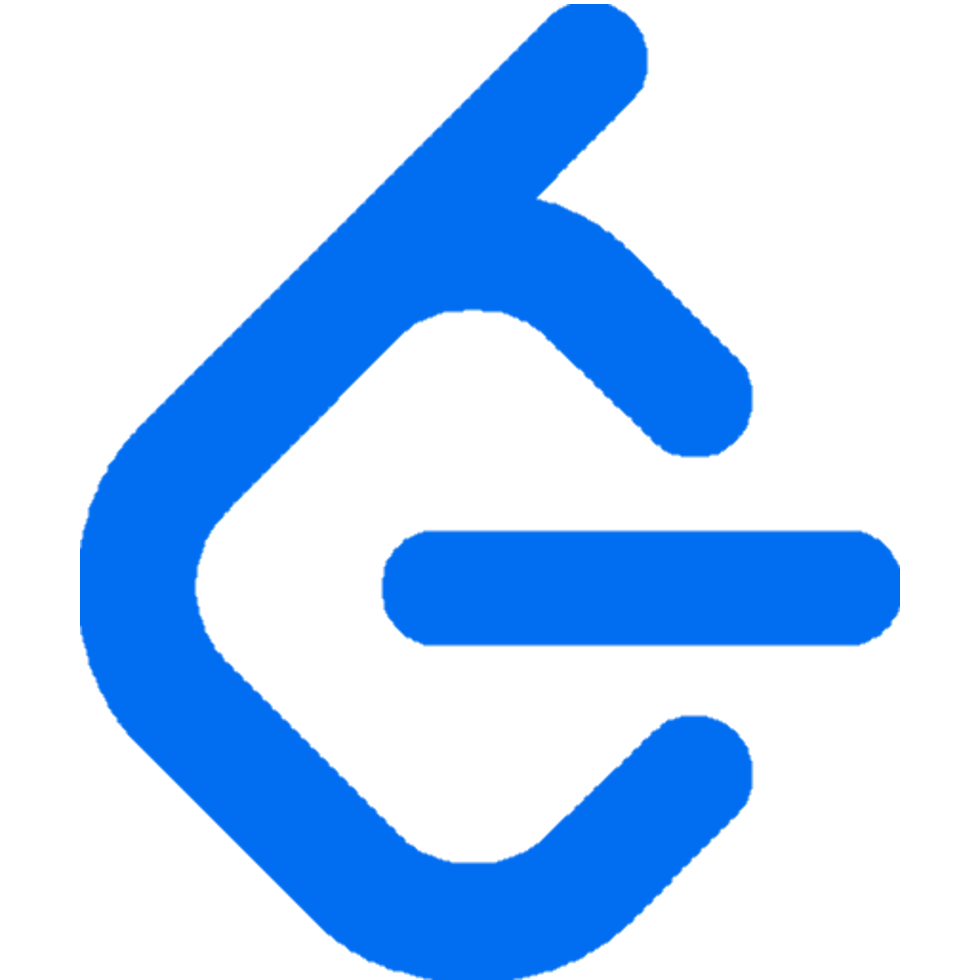
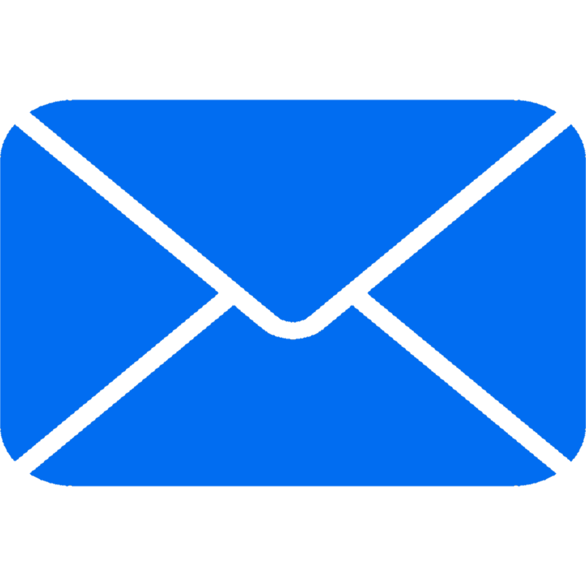
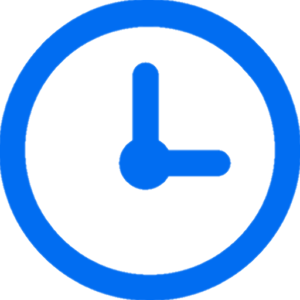

<h1 align="center">
   
  
  

    
    &#8287;&#8287;
    
    &#8287;&#8287;
    
    &#8287;&#8287;
    
  

</h1>

 

I've been programming for over 6 years. I started out in ethical hacking and cybersecurity, but moved into software engineering in early 2025. That background still shapes how I work ~ I care about secure design, clean structure, and building things that hold up over time.

Outside of coding, I play piano by ear ~ fast, emotional pieces that help me clear my mind. I've recently started composing my own music, which feels like a way to translate my thoughts into sound. I find peace in quiet moments spent outdoors, using the time to think through ideas. Painting is next on my list, a new way to bring ideas to life beyond code and music.

<h1></h1>

<h3>

 2025</h3>

<ul>
  <li>
    <strong>Cybersecurity Guest Lecturer ~ Northern Technical University</strong>
    <ul>
      <li>Delivered remote lectures to cybersecurity students in Iraq:
        <ul>
          <li>First-year students: Intrusion Detection Systems (IDS) ~ Practical security concepts + core theory</li>
          <li>Second-year students: TCP vs UDP ~ Real-world examples + interactive exercises</li>
        </ul>
      </li>
      <li>Hosted live Q&A sessions after each lecture, providing technical guidance and practical insights</li>
    </ul>
  </li>

  <li>
    <strong>Clash of Code ~ CodinGame</strong>
    <ul>
      <li>Competed in a 10-day coding contest with daily rounds</li>
      <li>Ranked 76th globally out of 12,619 participants (top 0.6%)</li>
      <li>Solved algorithmic challenges under time constraints, demonstrating problem-solving and speed</li>
    </ul>
  </li>
</ul>

<h3> 2026</h3>
<ul>
  <li>No notable achievements added yet</li>
</ul>
