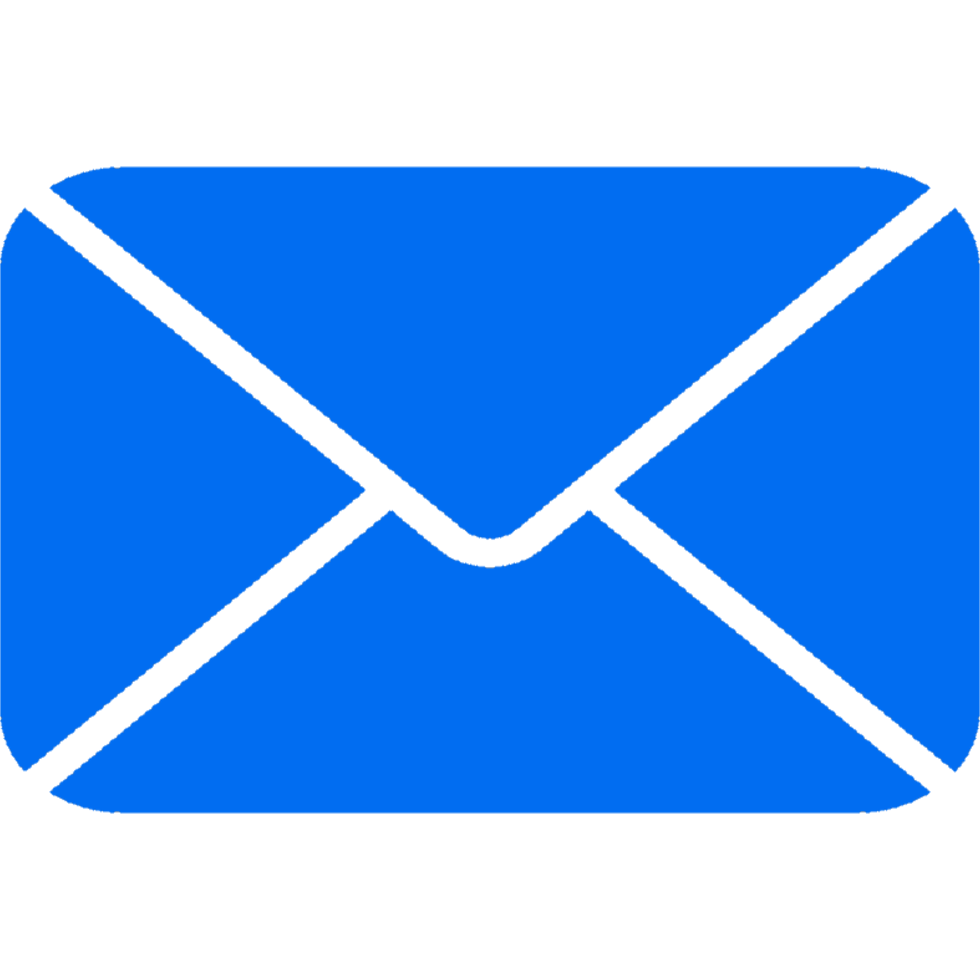
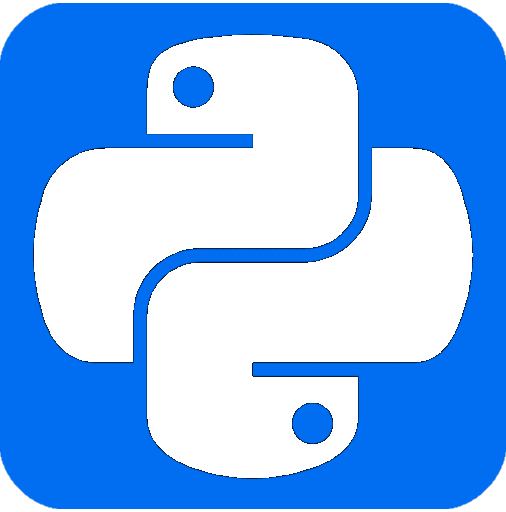
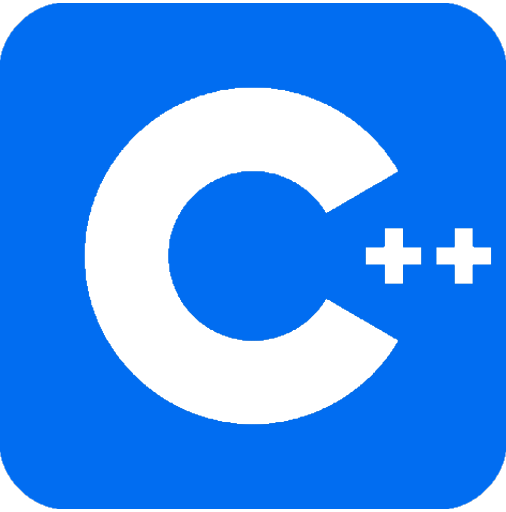
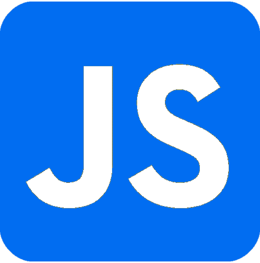

<h1 align="center">
   
  
  

    
    &#8287;&#8287;
    
    &#8287;&#8287;
    
    &#8287;&#8287;
    
  

</h1>

 

With 5+ years of programming experience, I transitioned from ethical hacking and cybersecurity into software engineering in early 2025. 
I discovered that my true passion lies in building practical software solutions rather than just securing systems. 
Today, I focus on crafting tools and applications that solve real-world problems, while continuously sharpening my skills through hands-on projects and ongoing learning.

<h1></h1>

 

  
  &#8287;&#8287;
  
  &#8287;&#8287;
  
  &#8287;&#8287;
  
  &#8287;&#8287;
  
  &#8287;&#8287;
  
  &#8287;&#8287;
  

